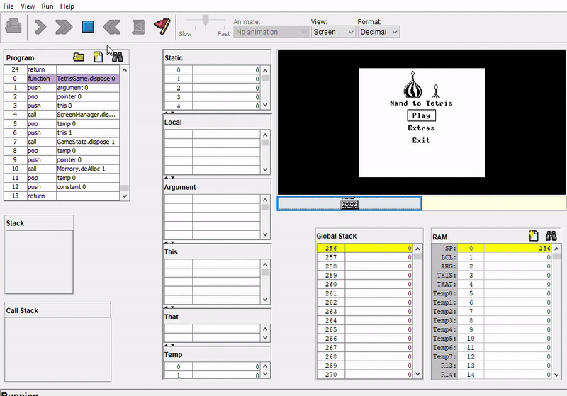

## About Me
I store here code snippets and projects.

    
  
  

  
  <!--
  the gif above resulotion is 320x180,and 320x288
  ---!>

list of languages I tried

  
| Index | Language |
| ----------- | ----------- |
| 1 | c, cpp |
| 2 | java |
| 3 | python |
| 4 | html, css |
| 5 | php |
| 6 | c# |
| 7 | java script |
| 8 | ASM (tried several instruction sets, used FASM, MASM and TASM.) |
| 9 | SQL |
| 10 | Fortran |
| 11 | Matlab |
| 12 | Bash |

  
Tools I can use

| Index | program |
| ---------- | ------------ |
| 1 | git, github |
| 2 | vscode, jetbrain products, code::blocks, vim and various other IDEs |
| 3 | CMake |
| 4 | Shell |
| 5 | Gimp, LMMS, Adobe products (creative file editing) |
| 6 | Libreoffice stuff |

<!--
**shay-abramov/shay-abramov** is a ✨ _special_ ✨ repository because its `README.md` (this file) appears on your GitHub profile.
-->
